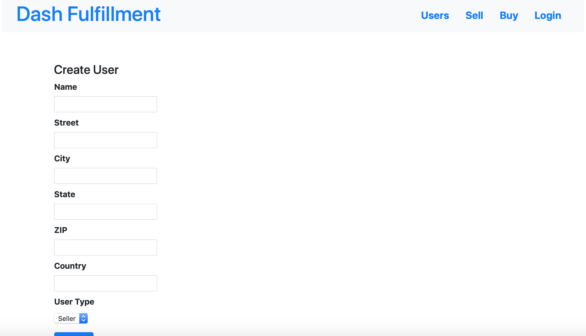
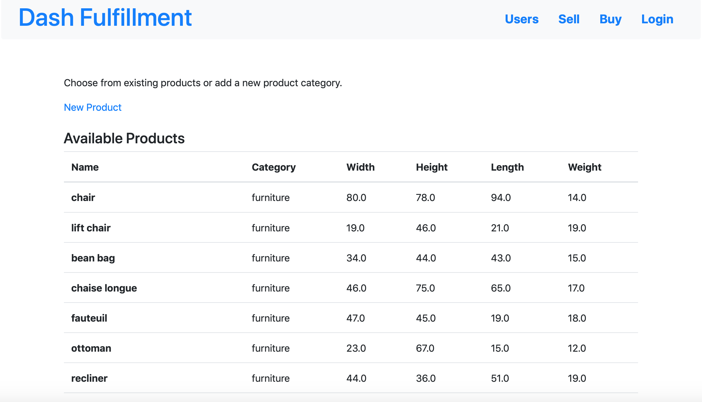
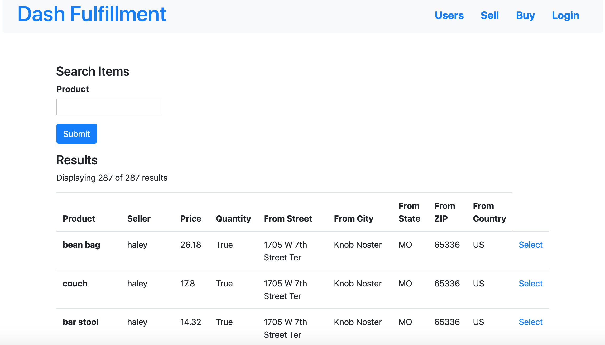
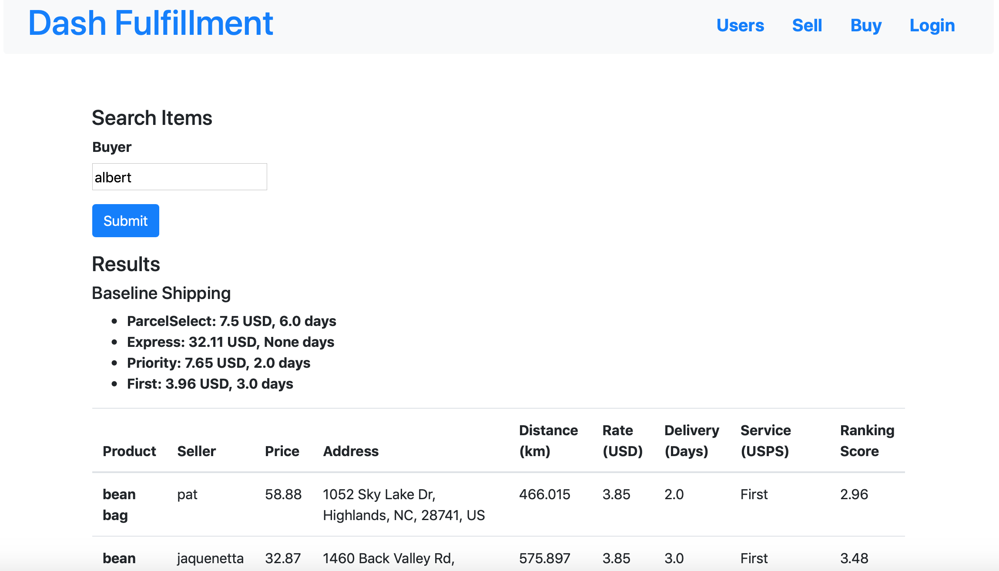

# DashProject

Our project aims to coordinate the exchange of common goods between small businesses to optimize shipping times for consumers. The application utilizes Python Flask and SQL. We design a ranking algorithm that factors in delivery time and shipping rate in order to determine the optimal shipping option. To determine delivery time and shipping rate, we integrate the EasyPost API. We optimize the ranking process by preprocessing shipping locations according to distances estimated using the Distance Matrix API (Google Maps Platform).

## User Page



## Sell Page



## Buy Page




Run server locally:

```
FLASK_APP=main.py flask run
```

## Docs

Flask setup:
https://opensource.com/article/18/4/flask

Starter:
https://www.freecodecamp.org/news/how-to-build-a-web-application-using-flask-and-deploy-it-to-the-cloud-3551c985e492/

Forms:
https://www.blog.pythonlibrary.org/2017/12/13/flask-101-how-to-add-a-search-form/
http://www.blog.pythonlibrary.org/2017/12/14/flask-101-adding-editing-and-displaying-data/

EasyPost for estimating shipping rates:
https://www.easypost.com/docs/api

Address data:
https://gist.github.com/HeroicEric/1102788

Database and Forms:
https://www.blog.pythonlibrary.org/2017/12/15/flask-101-filtering-searches-and-deleting-data/
https://flask-sqlalchemy.palletsprojects.com/en/2.x/queries/#querying-records

Database linking:
https://techarena51.com/blog/one-to-many-relationships-with-flask-sqlalchemy/
